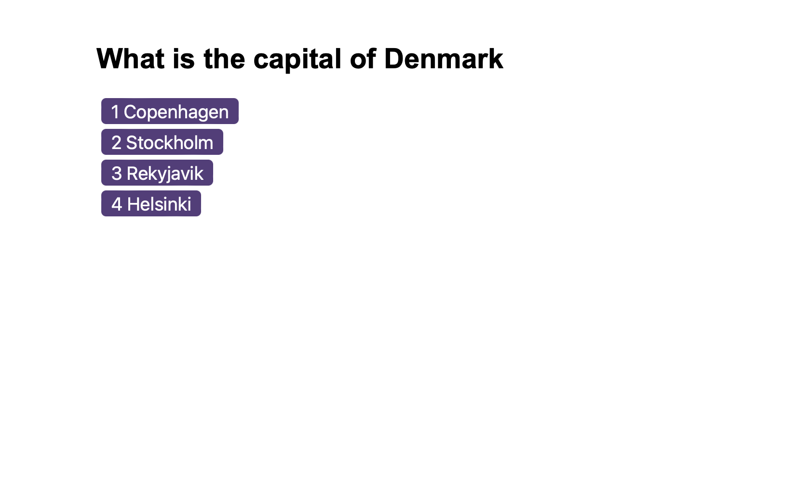
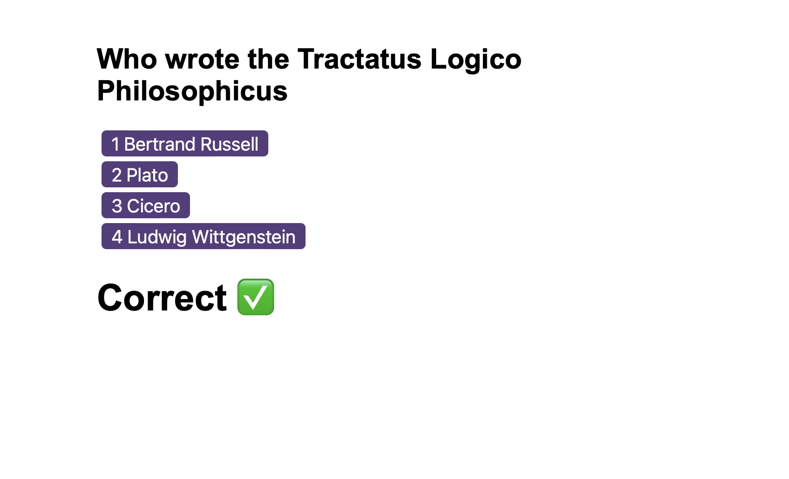
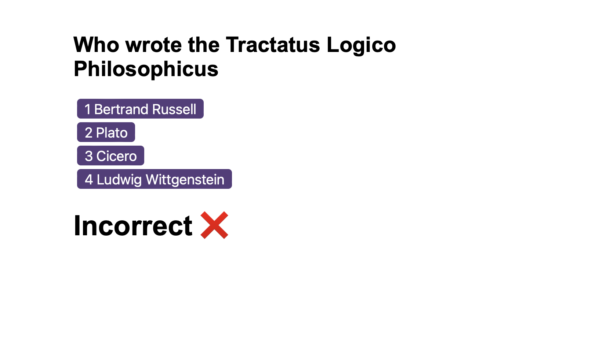
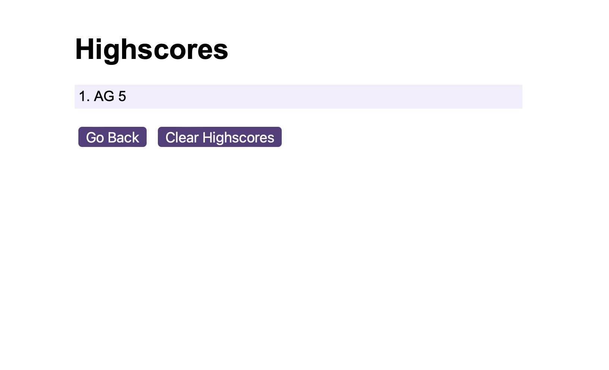

# JS-fundamentals-quiz
This application is a general knowledge quiz app which implements the following design requirements:

1. Is a timed quiz
2. Presents succession of questions
3. Penalises incorrect answers by way of time deductions
4. Forwards user to game over when time runs out / all questions answered.
5. Allows saving of initials and score.

## 1. Timing the Quiz
Once quiz is started, a 60 second timer comences.
The player must answer as many of the 10 questions as possible before the timer elapses else they will miss out on the maximum number of available points. Incorrect answers attract a 10sec time deduction.

## 2. Transitions of Questions:
The transition between questions are handled by functions which alter the DOM display to revel the next successive question object. Correct and incorrect answers are differentiated by the question objects which contain definitions of correct answers. A room for improvement would be to remove or lessen the dependency between the demarcation of a response as correct with an index- such that questions could be shuffled making the quiz more taxing.

## 3. Penalties
If a user enters an incorrect answer then 10 seconds are deducted from the remaining time. If the time reaches 0 then the quiz is over and the user may enter their details which can then be logged to local storage.

## 4. Gameover.
When the game ends through time elapsing or user completion, the user is prompted to enter their initials. The initials along with the cumulative score are saved to local storage as an object which is part of an array of all participants prior to the last reset of the highscore table. 

## 5. Saving details. 
When a user completes a game then the resulting score and initials are saved to a leaderboard. The leaderboard is an array of objects represented on screen. This fix allowed for both the connection between score and user initials, but further a concise means of storing all such inputs.

## End product:

Questions are displayed as follows:

Correct answers are displayed as follows with an accompanying audio for success

Incorrect answers are as follows:

Lastly, highscores are shown once all questions are answered / time elapses:

